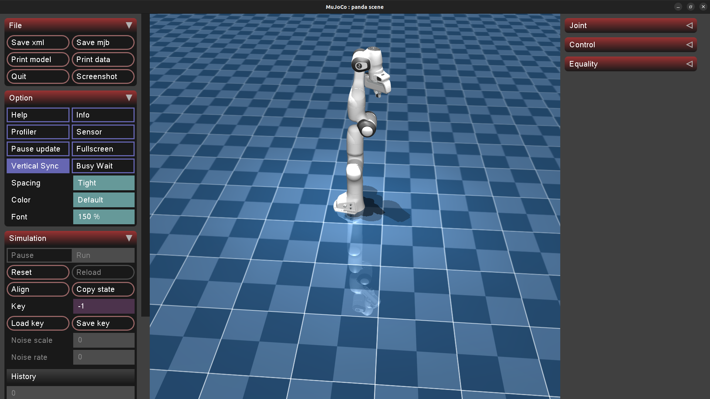
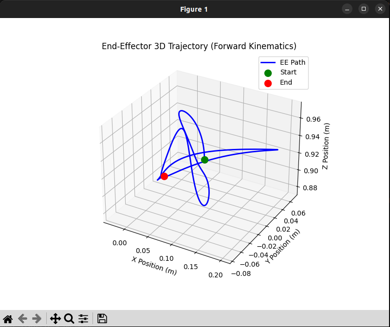
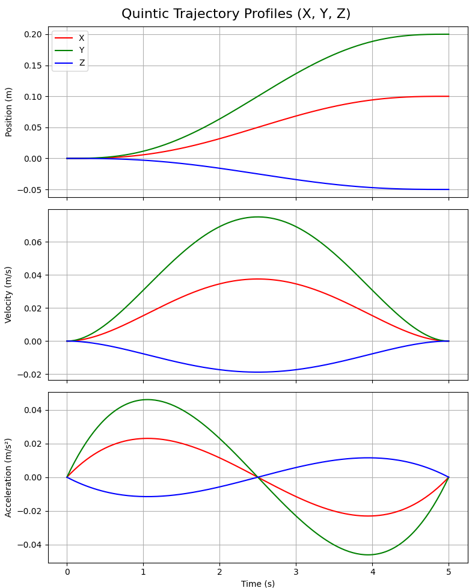

## RRC manipulation task

- Week 0 – Environment Setup
1. Set up Python, PyTorch, MuJoCo, CVXPY, Stable-Baselines3
2. Run a basic MuJoCo simulation successfully
- Week 1 – Robotics & Math Basics
1. Understand robot joints, end-effectors, frames
2. Implement simple forward kinematics and visualize trajectories
- Week 2 – Control & Trajectories
1. Learn PD and impedance control concepts
2. Implement quintic position + SLERP orientation trajectory generation
- Week 3 – Simulation Environment
1. Build a Gym-style dual-arm MuJoCo environment
2. Implement observations and resets (object pose, joints, end-effector states)
- Week 4 – QP-Based Controller (Core DAVIL Component)
1. Implement CVXPY-based QP impedance controller
2. Enforce joint, torque, and end-effector constraints
3. Convert accelerations to torques and validate in simulation
- Week 5 – Reinforcement Learning (PPO)
1. Understand PPO and actor–critic training
2. Train a PPO policy to predict stiffness values (K)
3. Integrate RL policy with the QP controller

## Run instructions
```bash
uv sync

# to run the Franka setup
uv run main.py
```



## Week 1
- Forward Kinematics and trajectory pic
```
uv run week1_kinematics.py
```



## Week 2
- Trajectory plot from test trajectories
```
uv run week2_test_traj.py
```


### Week 3
- Implemented observations and resets
```
uv run week3_test_env.py
```

### Week 4
## Math (Inverse Dynamics + Optimization)
1. Desired Task-Space Acceleration: 
- PD law to calculate the acceleration

$$\ddot{x}_{cmd} = K_p(x_{des} - x_{curr}) + K_d(\dot{x}_{des} - \dot{x}_{curr})$$

2. Objective Function:
- ask-space acceleration ($J\ddot{q}$) to match the desired one ($\ddot{x}_{cmd}$)

$$\min_{\ddot{q}} || J\ddot{q} - \ddot{x}_{cmd} ||^2 + \lambda ||\ddot{q}||^2$$

3. Constraints:
- bound the allowed joint accelerations to keep movement safe

$$\ddot{q}_{min} \le \ddot{q} \le \ddot{q}_{max}$$

4. Inverse Dynamic:
- Once CVXPY finds the optimal $\ddot{q}^*$, we use the rigid body dynamics equation to calculate the exact motor torques required, utilizing the Mass matrix $M(q)$ and gravity/Coriolis bias $h(q, \dot{q})$

$$\tau = M(q)\ddot{q}^* + h(q, \dot{q})$$
